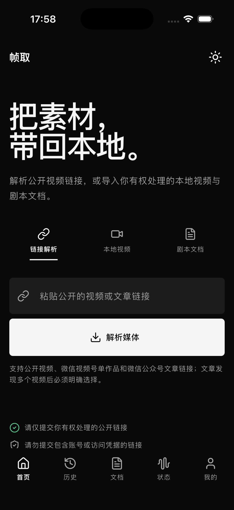
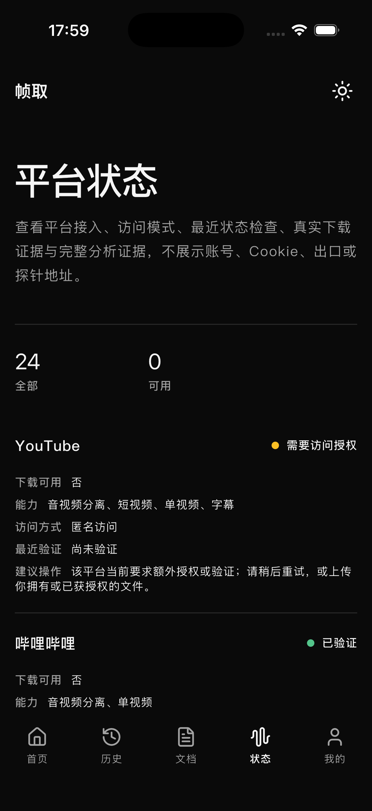

# FrameFetch（帧取）App

[English](README.en.md) · [服务端 / Web](https://github.com/StephenQiu30/video-server) · [项目文档](docs/README.md)

[](https://github.com/StephenQiu30/video-app/actions/workflows/flutter-quality.yml)
[](https://flutter.dev/)
[](#支持范围与限制)
[](LICENSE)

**FrameFetch（帧取）是面向自托管 `video-server` 的开源 Flutter 移动客户端。** 它让 iOS 与 Android 用户在原生界面中检查有权处理的公开视频、上传本地 MP4 与剧本文档、创建与跟踪下载任务，并按需发起由服务端执行的 AI 视频分析。

> **English summary:** FrameFetch is an open-source Flutter client for self-hosted media workflows on iOS and Android. It connects to `video-server` for authorized public-video inspection, format selection, download jobs, media access, provider health, and server-side AI video analysis.

FrameFetch 不在手机上运行提取器、转码器或 AI 模型，也不绕过 DRM、会员权限或平台访问控制。服务端与浏览器 Web 平台位于 [`video-server`](https://github.com/StephenQiu30/video-server)。

## App 预览

<p align="center">
  
  &nbsp;&nbsp;
  
</p>

<p align="center">
  <sub>左：链接检查与任务入口 · 右：服务端 Provider 状态（iPhone Simulator）· <a href="docs/images/README.md">截图来源</a></sub>
</p>

## 核心流程

```text
公开视频链接
    ↓
video-server 检查来源、访问决策与可用格式
    ↓
App 选择格式并创建下载任务
    ↓
跟踪进度、预览或获取服务端制品
    ↓
可选：由服务端 AI Worker 分析，App 展示结构化结果
```

- **原生认证**：注册、登录、会话恢复与退出均使用 Bearer 契约，不复用浏览器 Cookie 或 WebView。
- **公开项目首页**：未登录也能了解开源、自托管定位与主要能力，任务和账户数据继续要求认证。
- **公开视频工作流**：来源发现、链接检查、真实封面与元数据、格式选择、任务创建和进度刷新。
- **原生文件上传**：通过系统选择器上传本地 MP4，以及 DOCX、PDF、TXT、Markdown、Fountain 剧本文档；哈希与分片上传全程流式处理。
- **任务与媒体**：下载历史、详情、取消/重试、私有封面、MP4/WebM 跨格式播放与短期授权文件获取。
- **AI 视频分析**：选择服务端 Skill 与输出语言，创建、恢复、轮询、取消、重试或删除分析，并阅读结构化结果。
- **服务状态**：读取 `video-server` 返回的真实 Provider 状态；管理员可按角色进入移动管理中心。
- **原生体验**：Material 3、持久化的一键深浅主题、中英文本地化、动态字体、屏幕阅读器语义与 iOS/Android 导航习惯。

## 当前状态

当前版本为 `0.1.0+1`，适合自托管部署验证与开源协作。接口和交互仍可能随服务端契约演进。

| 能力 | 状态 | 说明 |
| --- | --- | --- |
| 原生 Bearer 登录与会话恢复 | 已实现 | Access Token 仅驻留内存；Refresh Credential 使用系统安全存储 |
| 公开链接检查、格式选择与下载创建 | 已实现 | 仅对服务端判定为可下载的内容创建任务 |
| 历史、详情、封面、播放与文件获取 | 已实现 | 文件地址由服务端短期授权；内置媒体运行时支持 H264/VP9/AV1 与 AAC/Opus |
| 视频 AI 分析 | 已实现 | 推理由 `video-server` 的 AI Worker 执行，App 负责配置、状态与结果展示 |
| 剧本文档列表 | 已实现 | 可读取服务端数据并覆盖加载、空态、失败与刷新 |
| 本地视频与剧本文档上传 | 已实现 | 系统选择器、流式 SHA-256、受限分片 PUT、ETag 校验和真实完成请求 |
| 剧本文档 AI、分析报告原生导出 | 待开放 | 等待独立契约、设计与验收 |
| WebSocket Token 更新 | 待开放 | 当前活动任务与分析使用受控轮询收敛状态 |
| 离线 AI、后台常驻下载、离线媒体库 | 不在首期范围 | App 不内置媒体执行器或 AI 模型 |

完整 Design → PRD → Plan → Acceptance 记录见 [`docs/README.md`](docs/README.md)，App 专用 OpenAPI 边界见 [`docs/contracts/README.md`](docs/contracts/README.md)。

## 5 分钟启动

### 1. 准备环境

- Flutter `3.44.7` stable / Dart `3.12.2`
- iOS：Xcode `26.6`，iOS `13+`
- Android：JDK `21`、Android API `24+`，JVM target `17`
- 一个可访问的 [`video-server`](https://github.com/StephenQiu30/video-server) 实例

```bash
git clone https://github.com/StephenQiu30/video-app.git
cd video-app
flutter doctor -v
flutter pub get
dart run tool/check.dart
```

### 2. 连接服务端并运行

iOS Simulator 连接本机服务端：

```bash
flutter run \
  --dart-define=VIDEO_SERVER_BASE_URL=http://127.0.0.1:8111
```

Android Emulator 连接宿主机服务端：

```bash
flutter run \
  --dart-define=VIDEO_SERVER_BASE_URL=http://10.0.2.2:8111
```

真机需要填写设备可访问的服务地址；生产构建必须使用有效的 HTTPS 地址。默认开发地址仅面向 iOS Simulator，不应直接用于发布制品。

## App 与 Server 的边界

| `video-app` | `video-server` |
| --- | --- |
| iOS/Android 原生界面、路由与辅助功能 | FastAPI API 与 Next.js Web 平台 |
| Bearer 会话、系统安全存储与生命周期 | 用户、角色、资源归属与授权事实 |
| 请求编排、状态展示与系统文件入口 | 媒体解析、下载、转封装与对象存储 |
| 视频播放能力检测与结果阅读 | Provider、队列、Worker 与 AI 推理 |

App 不维护服务端平行 DTO。REST 客户端从评审后的 App 专用 OpenAPI 快照生成，服务端实现和数据事实不复制到本仓库。

## 技术栈

- Flutter 3.44.7 / Dart 3.12.2，一套代码覆盖 iOS 与 Android
- Riverpod：单向状态与依赖装配
- go_router：声明式路由、深链接与认证重定向
- Dio + OpenAPI Generator 7.22.0：统一网络层与生成客户端
- media_kit + libmpv：开源跨平台播放器、标准控制与宽格式软硬件解码
- file_selector：Flutter 官方系统文件授权，不申请相册或全盘存储权限
- flutter_secure_storage：Keychain / Keystore 支持的凭据存储
- shared_preferences：非敏感浅色/深色主题偏好
- Material 3 + ARB：主题、语义与中英本地化

## 工程结构

```text
android/                      Android Kotlin 壳层
ios/                          iOS Swift 壳层
lib/
├── app/                      应用装配与类型安全路由
├── core/                     配置、网络、安全存储与主题
├── features/                 按用户能力组织的纵向模块
├── l10n/                     ARB 与生成的本地化代码
└── shared/                   稳定复用的无业务组件或模型
packages/video_server_api/    从冻结 OpenAPI 快照生成的 Dart 客户端
test/                         单元与 Widget 测试
integration_test/             模拟器/真机关键流程
tool/                         质量门禁与 OpenAPI 生成入口
docs/                         Design、PRD、Plan、Acceptance 与契约边界
```

## 安全与隐私

- 只处理你拥有或明确获授权的公开内容；不支持 DRM 绕过、会员内容提取或平台凭据导入。
- Access Token 只在内存中存在；Refresh Credential 只写入 Keychain/Keystore 支持的安全存储。
- 不把 Token、Cookie、完整媒体 URL query、预签名 URL、用户媒体或 AI 原始响应写入日志与分析事件。
- 媒体解析、下载和 AI 推理均在用户控制的 `video-server` 上执行；主动选择的本地文件仅上传到该服务端授权的对象存储会话，App 不提供离线提取器或离线 AI。
- 发现漏洞时请阅读 [`SECURITY.md`](SECURITY.md)，不要在公开 Issue 中披露凭据或可利用细节。

## 验证

提交变更前运行：

```bash
flutter pub get
dart format --output=none --set-exit-if-changed .
flutter analyze
flutter test
flutter test integration_test
flutter build apk --debug
flutter build ios --simulator --no-codesign
```

集成测试需要可用的 `video-server`、模拟器/真机以及对应测试条件。OpenAPI 快照或路由变更还需按 [`CONTRIBUTING.md`](CONTRIBUTING.md) 运行生成与漂移检查。

## 支持范围与限制

- 首期只支持 Android 与 iOS；本仓库不启用 Flutter Web、桌面端、车机或电视端。
- App 接受服务端允许的公开单条媒体链接，以及用户主动选择的 MP4/剧本文档；不接收 Provider Cookie、平台密钥、任意下载器参数、Shell 输入或私网 URL。
- 播放器内置宽格式解码运行时；原文件仍通过服务端短期授权入口获取，不改变下载产物格式。
- 不提供 App Store / Google Play 预构建包；当前请从源码构建。

## 参与项目

- 贡献流程：[`CONTRIBUTING.md`](CONTRIBUTING.md)
- 行为准则：[`CODE_OF_CONDUCT.md`](CODE_OF_CONDUCT.md)
- 安全策略：[`SECURITY.md`](SECURITY.md)
- 技术与产品文档：[`docs/README.md`](docs/README.md)
- 问题与建议：[GitHub Issues](https://github.com/StephenQiu30/video-app/issues)

提交 Issue 前请区分 App 与 Server：移动界面、原生会话和设备行为提交到本仓库；API、Web、Provider、队列、对象存储和 AI Worker 提交到 [`video-server`](https://github.com/StephenQiu30/video-server/issues)。

## 许可证

[MIT](LICENSE) © 2026 Stephen Qiu
