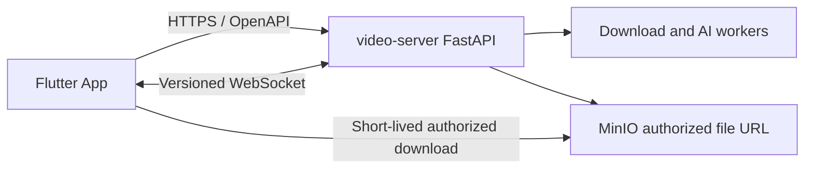

# 001 Flutter 跨端客户端架构设计

- 状态：Proposed
- 日期：2026-08-12
- 已确认决策：使用 Flutter；首期面向 iOS 与 Android；不重复建设 Web 平台

## 1. 目标与非目标

### 目标

1. 用一套 Flutter/Dart 代码提供帧取的 iOS 与 Android 原生体验。
2. 复用 `video-server` 已有解析、下载、历史、文件和 AI 分析能力。
3. 在前后台切换、弱网、断网和进程重启后可靠恢复任务状态。
4. 通过系统安全存储、短期凭据和严格日志边界保护用户会话。
5. 保持可测试、可生成、可升级的最小技术栈。

### 非目标

- Flutter Web、内嵌现有 Web 页面或第二套管理后台。
- 在 App 内运行 yt-dlp、FFmpeg、Provider extractor、AI 模型或对象存储服务。
- 首期支持 macOS、Windows、Linux、电视、车机或浏览器。
- 首期实现分享扩展、推送通知、后台常驻下载、离线媒体库或批量任务。
- 获取平台 Cookie、绕过 DRM、逆向签名或处理用户无权访问的内容。

## 2. 系统边界



App 只负责输入、展示、原生会话、生命周期和文件落地。所有媒体解析、Provider 访问、安全出口、异步执行、业务权限和状态事实仍由服务端负责。

## 3. 平台策略

- 首期只生成 `android/` 与 `ios/` 工程。
- 共享 Dart 层承载全部业务逻辑；平台代码只处理权限、安全存储、文件选择/保存、系统分享和生命周期桥接。
- 最低 Android/iOS 版本、Bundle ID、Application ID、签名与商店信息在 Plan Ready 前冻结。
- 桌面端必须先证明交互、文件系统、窗口生命周期、自动更新和发布签名差异，不因 Flutter 可编译就自动宣称支持。

## 4. 代码架构

```text
lib/
├── app/          应用入口、依赖装配、路由和生命周期
├── core/         配置、网络、错误、安全存储、主题和通用基础设施
├── features/     auth/download/history/analysis/providers/account
└── shared/       两个以上功能稳定复用的模型与 Widget
```

每个 feature 内部可按 `presentation/application/domain/data` 拆分，但只有真实复杂度出现时才创建层级。依赖方向为 `presentation → application/domain ← data`；feature 不直接导入其他 feature 的内部文件。

## 5. 技术决策

- 状态与依赖：Riverpod，一套单向状态模型。
- 路由：go_router，统一深链接、认证守卫和恢复路径。
- 网络：Dio，统一 TLS、超时、取消、幂等、错误和会话轮换。
- 契约：OpenAPI Generator `dart-dio`，生成目录只读。
- 安全存储：flutter_secure_storage；Access Token 仅驻留内存。
- 序列化：优先生成模型；不再维护手写平行 DTO。

依赖版本必须在实施 Plan 中固定并验证许可证、维护状态与平台兼容性。不得为同一职责并行引入多个框架。

## 6. 导航与状态恢复

首期页面：启动恢复、登录/注册、首页解析、格式选择、下载详情、历史、AI 分析结果、平台状态、账户和设置。

- 冷启动先恢复本地非敏感配置，再尝试安全会话恢复。
- 受保护深链接在完成会话恢复后继续；失败时进入登录并保留经过校验的站内目标。
- WebSocket 只用于加速状态更新，重连后必须重新查询服务端事实。
- App 进入后台时暂停非必要轮询；回到前台立即执行节流后的状态收敛。

## 7. 原生鉴权

浏览器 HttpOnly Cookie 不能直接作为原生 App 的最终方案。目标会话模型为：

1. Access Token 短期有效，只保存在内存中。
2. Refresh Credential 可轮换、可撤销，只进入 Keychain/Keystore 安全存储。
3. 并发 401 只触发一次刷新，其余请求等待同一结果。
4. 刷新失败、重放检测、用户禁用或全局退出后立即清空本地会话。
5. WebSocket 在凭据轮换后安全重建，不把 Token 放进日志或持久 URL。

服务端前置条件见 `docs/contracts/README.md`；未满足时认证 E2E 为 blocked。

## 8. 下载与本地文件

- 创建任务只发送用户输入和 API 支持的格式标识，不接收任意媒体参数。
- 任务状态来自服务端；App 不虚构清晰度、进度、文件大小或分析结果。
- 文件下载使用短期授权 URL，支持进度、取消、超时、存储不足和 URL 过期后重新授权。
- 临时文件写入 App 沙箱，通过完整性与大小检查后再交给系统保存/分享。
- 取消、失败、退出登录和空间不足时清理未完成临时文件。

## 9. 失败与离线

统一错误模型区分：输入无效、未认证、无权限、限流、离线、超时、服务不可用、任务失败、文件过期、空间不足和未知错误。每种错误必须提供准确说明与安全恢复动作，不显示内部异常、完整 URL 或 Provider Secret。

首期不提供离线业务能力；断网时可保留最近一次非敏感只读状态并明确标记陈旧，恢复网络后重新拉取。

## 10. 可访问性与质量

- Material 3 语义 token 支持深浅主题和系统文字缩放。
- 交互有准确 Semantics、可见焦点、足够触控目标与非颜色状态表达。
- Android 与 iOS 同时覆盖单元、Widget、Golden、集成和真实服务契约测试。
- Golden 只验证稳定视觉决策，不能替代可访问性、功能和真机证据。

## 11. Design Acceptance Criteria

- DAC-001：仓库只生成 Android/iOS Flutter 工程，不包含 Flutter Web 或第二套客户端。
- DAC-002：目录和依赖方向符合第 4 节，无跨 feature 内部耦合。
- DAC-003：OpenAPI 客户端可重复生成且无手写平行 DTO。
- DAC-004：原生会话契约通过独立服务端设计与安全验收。
- DAC-005：Access Token 不持久化，Refresh Credential 只进入系统安全存储。
- DAC-006：解析、任务、历史、文件和分析状态以服务端为事实来源。
- DAC-007：前后台切换、断网和 WebSocket 重连后能重新收敛状态。
- DAC-008：文件下载覆盖授权过期、取消、空间不足、完整性和临时文件清理。
- DAC-009：日志、崩溃和分析事件不泄露敏感数据或用户媒体。
- DAC-010：Android/iOS 关键流程均有自动化与真机/模拟器证据。
- DAC-011：核心页面满足深浅主题、文字缩放、屏幕阅读器和 reduced motion。
- DAC-012：管理端、Provider 执行、Flutter Web、桌面和首期非目标能力均未进入实现。
