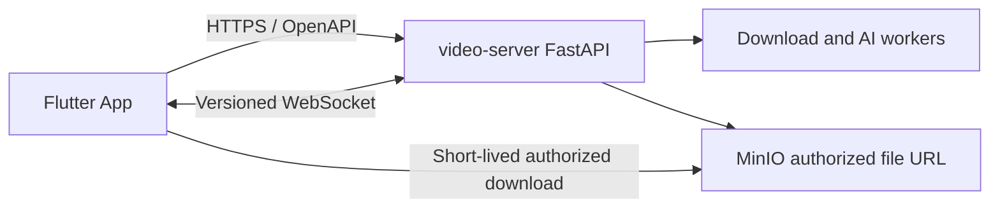

# 001 Flutter 跨端客户端架构设计

- 状态：Accepted
- 日期：2026-08-12
- 已确认决策：使用 Flutter；首期面向 iOS 与 Android；不重复建设 Web 平台

## 1. 目标与非目标

### 目标

1. 用一套 Flutter/Dart 代码提供帧取的 iOS 与 Android 原生体验。
2. 复用 `video-server` 已有解析、下载、历史、文件和 AI 分析能力。
3. 在前后台切换、弱网、断网和进程重启后可靠恢复任务状态。
4. 通过系统安全存储、短期凭据和严格日志边界保护用户会话。
5. 保持可测试、可生成、可升级的最小技术栈。

### 非目标

- Flutter Web、内嵌现有 Web 页面或第二套管理后台。
- 在 App 内运行 yt-dlp、FFmpeg、Provider extractor、AI 模型或对象存储服务。
- 首期支持 macOS、Windows、Linux、电视、车机或浏览器。
- 首期实现分享扩展、推送通知、后台常驻下载、离线媒体库或批量任务。
- 获取平台 Cookie、绕过 DRM、逆向签名或处理用户无权访问的内容。

## 2. 系统边界



App 只负责输入、展示、原生会话、生命周期和文件落地。所有媒体解析、Provider 访问、安全出口、异步执行、业务权限和状态事实仍由服务端负责。

## 3. 平台策略

- 首期只生成 `android/` 与 `ios/` 工程。
- 共享 Dart 层承载全部业务逻辑；平台代码只处理权限、安全存储、文件选择/保存、系统分享和生命周期桥接。
- Android 最低 API 24，iOS 最低 13；组织 ID 为 `com.stephenqiu`，Application ID 与 Bundle ID 均为 `com.stephenqiu.framegrab`，显示名称为“帧取”。商店发布前必须再次确认标识所有权。
- Android 使用 Kotlin、JVM target 17；iOS 使用 Swift 与 Flutter 3.44 默认 Swift Package Manager 集成。发布签名只由可信发布环境注入，不回退到 Android debug key。
- 桌面端必须先证明交互、文件系统、窗口生命周期、自动更新和发布签名差异，不因 Flutter 可编译就自动宣称支持。

## 4. 代码架构

```text
lib/
├── app/          应用入口、依赖装配、路由和生命周期
├── core/         配置、网络、错误、安全存储、主题和通用基础设施
├── features/     auth/download/history/analysis/providers/account
└── shared/       两个以上功能稳定复用的模型与 Widget
```

每个 feature 以 `presentation → view model/application → repository → service` 为主依赖方向；只有多 repository 编排或复杂规则出现时才增加独立 domain/use-case 层。该结构落实 Flutter 官方推荐的 UI/Data 分层、repository 与依赖注入，不为形式创建空层。feature 不直接导入其他 feature 的内部文件。

## 5. 技术决策

| 职责 | 选择 | 基线 | 许可证 | 决策 |
| --- | --- | --- | --- | --- |
| SDK | Flutter / Dart | 3.44.7 / 3.12.2 | BSD-3-Clause | stable 单一工具链，提交 `.metadata` 与 `pubspec.lock` |
| 状态与 DI | flutter_riverpod | 3.4.2 | MIT | 单向状态、可覆盖依赖和可测试异步流程；不并行引入 Bloc/GetX/Provider |
| 路由 | go_router / go_router_builder | 17.5.0 / 4.4.0 | BSD-3-Clause | Flutter 团队维护，生成类型安全深链接；不维护第二套路由器 |
| HTTP | Dio | 5.11.0 | MIT | 单实例、统一超时/取消/拦截器；禁止业务页面直接请求和生产请求体日志 |
| 契约 | OpenAPI Generator `dart-dio` | 7.22.0 | Apache-2.0 | 使用稳定生成器和冻结快照；生成包只读，不手写平行 DTO |
| Secret | flutter_secure_storage | 10.3.1 | BSD-3-Clause | Android 独立 namespace + Keystore、iOS 本机不迁移 Keychain；只保存获批 Refresh Credential |
| 本地化 | Flutter gen-l10n / intl | SDK / 0.20.2 | BSD-3-Clause | ARB 是 UI 文案事实来源，首期 `zh` / `en` |
| 代码生成 | build_runner | 2.15.1 | BSD-3-Clause | 这是与 Flutter 3.44.7 的 `meta` 固定版本兼容的最高解析版本 |

[`flutter_secure_storage` 11.0.0](https://pub.dev/packages/flutter_secure_storage/changelog) 虽已发布，但它要求 Android `compileSdk 37`，而 Flutter 3.44.7 默认基线为 36，并且该主版本移除了 v10 已废弃算法的兼容路径。本阶段因此固定已验证的 10.3.1，待 Flutter 工具链对齐且有安全存储实现时单独评审升级。

`shared_preferences`、本地数据库、WebSocket 客户端、崩溃平台、分析 SDK 和文件插件均延后到真实用例与隐私评审出现时再引入。WebSocket 当前尤其不能接入，因为服务端只支持 Cookie 鉴权。依赖采用 pubspec 约束 + 应用 lockfile，Dependabot 每周提出受 CI 约束的更新。当前仅安装并锁定选型依赖，不实现会话、网络 repository 或业务页面。

视觉事实来源为 `video-server/frontend/src/app/globals.css`：浅色背景/前景使用 `#FAFAFA` / `#0A0A0A`，深色背景/前景使用 `#0A0A0A` / `#F5F5F5`，基础圆角为 6px。后续页面延续语义色、充足留白、无重阴影与内容优先层级；移动端使用 Material 3 与系统字体，将 Web 设计语言转换为系统返回、安全区、触控目标和动态字体，不照搬网页固定网格或 Web 控件。

参考：[Flutter 架构指南](https://docs.flutter.dev/app-architecture/guide)、[架构建议](https://docs.flutter.dev/app-architecture/recommendations)、[Flutter 3.44 支持平台](https://docs.flutter.dev/reference/supported-platforms)、[dart-dio 生成器](https://openapi-generator.tech/docs/generators/dart-dio/)。

## 6. 导航与状态恢复

首期页面：启动恢复、登录/注册、首页解析、格式选择、下载详情、历史、AI 分析结果、平台状态、账户和设置。

- 冷启动先恢复本地非敏感配置，再尝试安全会话恢复。
- 受保护深链接在完成会话恢复后继续；失败时进入登录并保留经过校验的站内目标。
- WebSocket 只用于加速状态更新，重连后必须重新查询服务端事实。
- App 进入后台时暂停非必要轮询；回到前台立即执行节流后的状态收敛。

## 7. 原生鉴权

浏览器 HttpOnly Cookie 不能直接作为原生 App 的最终方案。目标会话模型为：

1. Access Token 短期有效，只保存在内存中。
2. Refresh Credential 可轮换、可撤销，只进入 Keychain/Keystore 安全存储。
3. 并发 401 只触发一次刷新，其余请求等待同一结果。
4. 刷新失败、重放检测、用户禁用或全局退出后立即清空本地会话。
5. WebSocket 在凭据轮换后安全重建，不把 Token 放进日志或持久 URL。

服务端前置条件见 `docs/contracts/README.md`；未满足时认证 E2E 为 blocked。

## 8. 下载与本地文件

- 创建任务只发送用户输入和 API 支持的格式标识，不接收任意媒体参数。
- 任务状态来自服务端；App 不虚构清晰度、进度、文件大小或分析结果。
- 文件下载使用短期授权 URL，支持进度、取消、超时、存储不足和 URL 过期后重新授权。
- 临时文件写入 App 沙箱，通过完整性与大小检查后再交给系统保存/分享。
- 取消、失败、退出登录和空间不足时清理未完成临时文件。

## 9. 失败与离线

统一错误模型区分：输入无效、未认证、无权限、限流、离线、超时、服务不可用、任务失败、文件过期、空间不足和未知错误。每种错误必须提供准确说明与安全恢复动作，不显示内部异常、完整 URL 或 Provider Secret。

首期不提供离线业务能力；断网时可保留最近一次非敏感只读状态并明确标记陈旧，恢复网络后重新拉取。

## 10. 可访问性与质量

- Material 3 语义 token 支持深浅主题和系统文字缩放。
- 交互有准确 Semantics、可见焦点、足够触控目标与非颜色状态表达。
- Android 与 iOS 同时覆盖单元、Widget、Golden、集成和真实服务契约测试。
- Golden 只验证稳定视觉决策，不能替代可访问性、功能和真机证据。

## 11. Design Acceptance Criteria

- DAC-001：仓库只生成 Android/iOS Flutter 工程，不包含 Flutter Web 或第二套客户端。
- DAC-002：目录和依赖方向符合第 4 节，无跨 feature 内部耦合。
- DAC-003：OpenAPI 客户端可重复生成且无手写平行 DTO。
- DAC-004：原生会话契约通过独立服务端设计与安全验收。
- DAC-005：Access Token 不持久化，Refresh Credential 只进入系统安全存储。
- DAC-006：解析、任务、历史、文件和分析状态以服务端为事实来源。
- DAC-007：前后台切换、断网和 WebSocket 重连后能重新收敛状态。
- DAC-008：文件下载覆盖授权过期、取消、空间不足、完整性和临时文件清理。
- DAC-009：日志、崩溃和分析事件不泄露敏感数据或用户媒体。
- DAC-010：Android/iOS 关键流程均有自动化与真机/模拟器证据。
- DAC-011：核心页面满足深浅主题、文字缩放、屏幕阅读器和 reduced motion。
- DAC-012：管理端、Provider 执行、Flutter Web、桌面和首期非目标能力均未进入实现。
