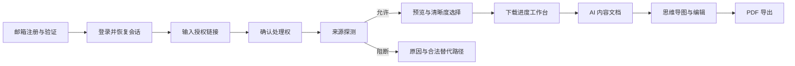

# 授权视频工作台体验设计

## 1. 产品体验定义

`video-web` 是“授权视频下载与 AI 知识化工作台”的用户界面。用户先通过邮箱完成注册、验证和登录，再粘贴自己有权处理的视频链接。浏览器只使用 Server PostgreSQL DatabaseStrategy 设置的 HttpOnly 会话 Cookie：生产为 `__Host-video_session`，显式 loopback 开发 profile 为 `video_session_dev`；Web 不签发或解析会话。来源探测先展示能力与政策结论，再提供真实清晰度；下载完成后可进入带时间证据的摘要、章节、思维导图和 PDF。

“万能”代表统一入口和可扩展适配器，不代表所有网站都能下载。界面消费服务端 canonical code：`SOURCE_POLICY_BLOCKED`、`SOURCE_DRM_UNSUPPORTED`、`SOURCE_DOWNLOAD_DISABLED`、`SOURCE_AUTH_REQUIRED` 和 `SOURCE_UNSUPPORTED`，不能用模糊失败掩盖合规边界。

## 2. 端到端旅程

下载、AI 和 PDF 是独立子任务。下载成功但 AI 失败时文件仍可用；AI 部分成功时可单独重试失败阶段；PDF 链接过期时只重签，不重新执行前序任务。

## 3. 信息架构

| 路由 | 责任 |
| --- | --- |
| `/login` | 邮箱登录、会话过期提示和安全返回目标 |
| `/register` | 邮箱注册与验证邮件说明 |
| `/verify-email#token=…` | 读取 fragment、立即清除并交换一次性验证 token |
| `/forgot-password`、`/reset-password#token=…` | 不暴露账号存在性的重置申请与 fragment token 交换 |
| `/?resolution={id}&format={key}` | 产品说明、链接输入、来源探测、刷新恢复和本地规格选择 |
| `/tasks/[taskId]` | 当前任务的规格、下载、AI、思维导图和 PDF 工作台 |
| `/library` | 私有历史任务、失败重试、重新下载和删除 |
| `/legal/supported-sources` | 来源政策、允许动作和限制 |
| `/privacy` | 视频、转写、AI 供应商、保留和删除说明 |

Plan 000 实现认证路由、受保护路由外壳和会话恢复。Plan 001 只实现 `/` 的 query 驱动来源状态；`format` 可省略且只保存 opaque key。其余工作台路由由后续 Plan 解锁。

## 4. 视觉方向

采用“剪辑台 × 研究笔记”而不是通用 SaaS 卡片墙：

- 左侧或上方是深墨色媒体控制区，强调来源、时间码和真实规格。
- 右侧或下方是暖纸色知识文档区，承载摘要、章节和图谱。
- 铜橙用于当前步骤与可操作元素；苔绿色只表示通过或完成；朱红只表示危险与阻断。
- 标题使用中文衬线字体，正文使用清晰中文无衬线字体，规格与时间码使用等宽字体。
- 背景使用细微纸纹和轨道刻度，不使用紫色渐变、玻璃拟态和同质化卡片。
- 动效模拟扫描、时间轴推进和纸张展开；支持 `prefers-reduced-motion`。

## 5. 关键组件

- `AuthShell`：恢复安全的用户投影，处理会话过期和受保护路由。
- `EmailAuthForm`：注册、登录、忘记密码和重置密码的共享可访问字段。
- `SessionNotice`：验证待完成、会话失效、退出完成和限流反馈。
- `SourceUrlForm`：URL、权利确认、提交和字段错误。
- `SourceProbeStatus`：排队、校验、政策、解析和归一化阶段。
- `PolicyNotice`：阻断原因、政策来源和合法替代路径。
- `MediaPreview`：标题、来源、时长和解析时间；Plan 001 不加载第三方缩略图。
- `VariantPicker`：语义化 Radio Group 与桌面规格表。
- `JobTimeline`：下载、AI 和 PDF 的独立状态轨。
- `DownloadProgress`：可空进度、速度、字节和取消。
- `SummaryDocument`：可编辑结构化内容与证据链接。
- `MindMapView` / `MindMapOutline`：共享同一 JSON 数据源。
- `PdfExportPanel`：版本、导出、失败重试和重签。
- `ErrorNotice`：稳定错误码到用户动作的映射。

## 6. 清晰度交互

每个规格显示实际宽高、FPS、HDR、容器、视频/音频编码、是否含音频、是否需要合并和预计大小。未知字段显示“未知”，不能显示 0 或虚假估算。

提供“推荐”“最高清晰度”“最小文件”快捷筛选，但选择值始终是服务器返回的不透明 `format_key`。前端不得接触真实媒体 URL 或拼接 yt-dlp selector。

## 7. 响应式

- `<768px`：单列步骤流，规格表转换为可键盘操作的规格卡；主操作保持可见。
- `768–1199px`：上下分区，当前任务摘要保持在视口附近。
- `≥1200px`：5/7 分栏的控制台与知识文档工作台。
- 移动端思维导图默认大纲模式，可切换画布；页面不得整体横向滚动。

## 8. 合规与隐私交互

邮箱验证、权利确认与 AI 第三方处理同意是三个独立动作。登录页不能确认下载权利，权利确认也不能代表同意 AI 处理。用户修改 URL 时只清除已有确认、旧 key、选择与任务引用；再次确认并主动提交时才生成新 key/Probe，不覆盖旧任务。所有结果默认私有；删除入口不能隐藏在二级菜单。

验证邮件和密码重置的完成提示不得透露其他邮箱是否注册。一次性 token 只能放在 URL fragment；页面读取后先用 `history.replaceState` 清除 fragment，再 POST 交换。token 不得使用 query string，也不能留在浏览器历史。认证页面不加载第三方字体、图片或分析脚本。退出和会话失效必须清理用户相关客户端缓存，不能在下一个主体登录后展示旧数据。

来源被阻断时不提供“仍然尝试”“导入 Cookie”或代理绕过；可提供平台官方入口或本地文件上传。

## 9. 分阶段体验

| Plan | Web 交付 |
| --- | --- |
| 000 | 邮箱注册、验证、登录、退出、重置、会话恢复和 CSRF 门禁 |
| 001 | 链接、权利确认、解析 SSE/轮询恢复、错误解释和清晰度目录 |
| 002 | 创建下载、下载事件恢复、取消和资产下载 |
| 003 | AI 同意、转写、摘要、章节、思维导图与部分成功 |
| 004 | 编辑、PDF、历史、重签、删除与生命周期 |

未进入当前 Plan 的功能不提供假按钮或假结果；最多显示准确的路线说明。

## 10. 变更记录

| 版本 | 日期 | 变更说明 |
| --- | --- | --- |
| 2.0.0 | 2026-07-18 | 独立复审通过；用 Server 邮箱 UUID 身份、数据库 Cookie 会话与 CSRF 替换 installation token 体验，不保留双轨 |
| 1.0.0 | 2026-07-18 | 独立产品与跨仓复审通过，冻结体验基线 |
| 0.3.0 | 2026-07-18 | 明确 URL 编辑不会绕过权利确认自动创建 Probe |
| 0.2.0 | 2026-07-18 | 补齐本地主体、canonical 错误、恢复 URL 与 Plan 分期 |
| 0.1.0 | 2026-07-18 | 初始化旅程、信息架构、视觉和合规体验 |
