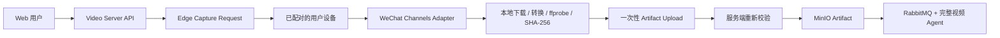

# 微信视频号 Provider 接入调研

- 日期：2026-08-12
- 结论：微信视频号没有适合现有无状态 Media Runner 的匿名公网 extractor；可行开源路线是用户设备 Edge Agent，当前代码尚未实现，Provider 状态保持 `unsupported`

## 1. 开源项目核验

以下数据为调研日当日的 GitHub 快照，Star 只表示社区覆盖面，不代表生产可用性。

| 项目 | 快照 | 核心路径 | 许可与决策 |
| --- | --- | --- | --- |
| [`nobiyou/wx_channel`](https://github.com/nobiyou/wx_channel) | 2,369 Star，2026-08-11 仍更新 | Windows 微信 + SunnyNet 本地代理 + 页面注入 + WebSocket/HTTP API + 本地下载解密 | 顶层 MIT，源码完整，是首要架构参考；内置 SunnyNet 和注明来自已删除仓库的解密代码，复用前仍需来源与依赖许可审计 |
| [`putyy/res-downloader`](https://github.com/putyy/res-downloader) | 19,092 Star，2026-06-18 更新 | Go + Wails 跨平台资源嗅探，通过可选域名规则执行本地 HTTPS 代理，视频号媒体另行本地解密 | Apache-2.0，可借鉴选择性代理、跨平台 UI 和资源管道；README 另有“禁止商业”声明且许可澄清 Issue 未关闭，引入前需确认 |
| [`ltaoo/wx_channels_download`](https://github.com/ltaoo/wx_channels_download) | 8,560 Star，2026-08-12 仍更新 | macOS/Windows/Linux 本地代理、根证书、页面注入、后台下载和分享链接 Worker | Commons Clause + MIT，不允许未另行授权的销售型使用；只作行为和运维参考，不嵌入商业服务 |
| [`Rodert/WeixinVideoDownload`](https://github.com/Rodert/WeixinVideoDownload) | 2 Star，2025-10-31 更新 | SunnyNet 本地代理与证书 | Apache-2.0，社区和验证证据弱，不作为基线 |
| `qiye45/wechatVideoDownload` / `lecepin/WeChatVideoDownloader` | 高 Star，但前者主要是二进制/资源，后者已归档 | 缺少可审计的完整源码 | 无清晰许可证，排除 |

[`yt-dlp/yt-dlp`](https://github.com/yt-dlp/yt-dlp) 当前没有微信视频号 extractor。开源实现形态高度一致：媒体数据与客户端上下文绑定，需要已登录的微信客户端参与，不是服务端对分享 URL 执行一次 HTTP GET 就能稳定获取。

## 2. 已验证的技术链路

对 `nobiyou/wx_channel`、`ltaoo/wx_channels_download` 和 `putyy/res-downloader` 的源码核验得到以下共性：

1. **采集在客户端侧发生**：本地代理仅处理微信/视频号相关域名，并向客户端页面注入受控脚本。
2. **分享链接需要页面上下文**：注入代码在 `channels.weixin.qq.com` 上下文中用 `shortUri` 请求分享详情，得到作品身份、短时媒体 URL/token、`decodeKey`、封面、时长和大小。
3. **受保护前缀在本地转换**：开源项目用 `decodeKey` 初始化 ISAAC64 密钥流，对默认 128 KiB 加密区域做 XOR，并维护 HTTP Range 偏移；结果仍需要 MP4 头、轨道、时长和哈希校验。
4. **元数据能力高于单视频下载**：活跃项目已支持首页、作者页、搜索、批量下载、评论分页和导出，可为后续内容分析提供作品与互动上下文。
5. **上游变更频繁**：当日仍有新版微信无法下载、原始视频失败和解密失败 Issue，因此必须将客户端版本与 canary 绑定，不能发布后永久标记为可用。

## 3. 推荐架构

视频号与红果共用 `user_device` 访问模式和 Artifact Import 协议，但使用不同的设备端 Adapter。

### 3.1 服务端控制面

- 新增 `ProviderAccessMode.USER_DEVICE`，不复用 `anonymous` 或 `operator_managed` Runner。
- 用户选择已配对设备后创建有 TTL 的 Edge Capture Request；任务只含输入链接、Provider、用户权利声明和大小/时长上限。
- 每任务发放只能写一个对象的一次性上传会话；Edge Agent 不获得 MinIO 、数据库、RabbitMQ 或 AI 通用凭据。
- 服务端重新计算 SHA-256，执行 ffprobe 和大小/时长/轨道门禁，校验 Provider、作品 ID 与任务绑定后才创建 Artifact。
- 下载与分析仍是两个独立任务；设备采集失败不生成空制品，AI 失败不改写制品导入成功状态。

### 3.2 视频号 Edge Adapter

- 首期只支持 Windows 10+ 和经 canary 的固定微信版本，不因 Go 代码可交叉编译就声称 macOS/Linux 可用。
- 本地端口只绑定 loopback，管理 API 需要每安装独立的设备密钥；不开放无认证 Web 控制台到局域网。
- 根证书与私钥必须每安装随机生成、本地存储和可一键卸载；不复用开源仓库中内置的通用 `SunnyRoot.key`。
- 代理尽可能限定到微信进程和经审查的第一方域名，任务完成/异常退出都必须恢复代理设置。
- `decodeKey`、媒体 token、Cookie、请求/响应原文和 CA 私钥只留在本地内存或单任务目录，日志和上传 manifest 中均不得出现。
- 首期只采集用户明确选中的单个视频；批量作者归档、评论导出和雷达监控等高风险能力后置。

### 3.3 开源代码复用策略

1. 优先独立实现窄协议 Adapter，不整库 fork 或把桌面应用嵌入服务端。
2. 若复用 `nobiyou/wx_channel` 的 MIT 代码，逐文件记录来源、保留版权声明，并对内置 SunnyNet、WASM/解密代码及其原始来源单独审计。
3. `putyy/res-downloader` 只借鉴 Apache-2.0 下的选择性 MITM 和 Wails 应用边界；许可声明冲突没有澄清前不复制源码。
4. `ltaoo/wx_channels_download` 受 Commons Clause 限制，商业产品不复制、链接或再发行其功能性代码。
5. 密钥流转换若需自行实现，以公开算法规格和授权样本黑盒测试为依据，不从来源不明的已删除仓库拷贝代码。

## 4. 不采用的方案

- 不将用户分享链接发给 `sph.litao.workers.dev` 或其他公共解析站。
- 不在中心服务保存微信/元宝 Cookie，不使用单一运维账号为所有用户代理内容权益。
- 不把本地代理伪装成 Docker 内的无状态 Provider；它依赖客户端版本、已登录会话和设备信任链。
- 不直接运行无源码或无许可证的高 Star 二进制。
- 不默认开启批量扫描、评论抓取、账号搜索或持续监听。

## 5. 发布门禁

视频号从 `unsupported` 调整为 `access_required`/`verified` 前需要：

1. 固定 Edge Agent 版本、Windows 版本和微信版本，记录 SBOM、转载许可、源码来源和可重复构建结果。
2. 用项目自有或明确授权的单个视频完成分享链接→本地 MP4→一次性上传→服务端校验→MinIO→AI 报告 E2E。
3. 微信未登录、设备离线、分享链接过期、无视频、加密前缀变化、解密失败、上传过期、哈希不匹配和超限负例。
4. 确认代理仅覆盖评审域名、其他 HTTPS 不被解密，异常退出恢复网络，根证书可卸载。
5. 通过流量和日志验收，证明服务端未收到 Cookie、token、`decodeKey`、CA 私钥、原始响应或带签名媒体 URL。
6. 加入客户端版本 canary 与自动降级；连续失败后停止发放新任务，而不对用户链接无界重试。

## 6. 实施顺序

1. 先实现通用 Artifact Import 和原始媒体上传，让红果/视频号成品视频能够立即进入现有分析链路。
2. 实现设备配对、Edge Capture Request、一次性上传与服务端复验协议。
3. 以 Windows 视频号单视频 Adapter 作为第一个 Edge Agent 端到端实现，因为它有许可更清晰、源码更完整的开源参考。
4. 稳定后复用同一设备协议实现 Android 红果 Adapter；红果无许可证参考代码不进入生产仓库。
5. 最后再评估视频号批量、评论和红果整剧能力，每类能力单独限额、授权和 canary。
