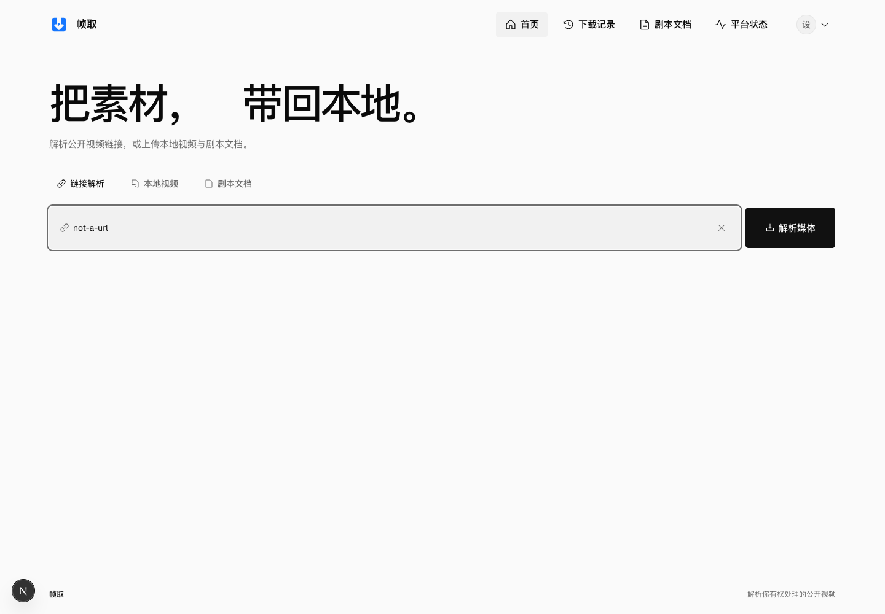
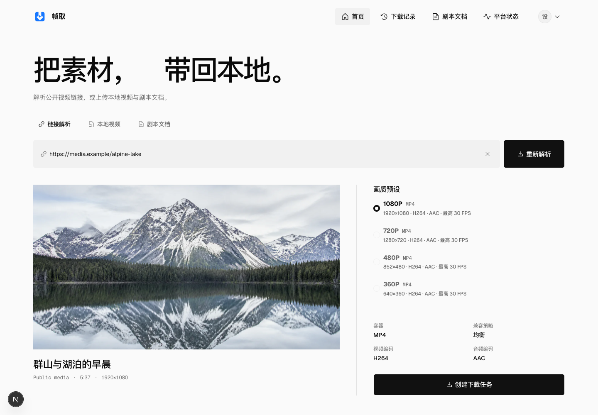
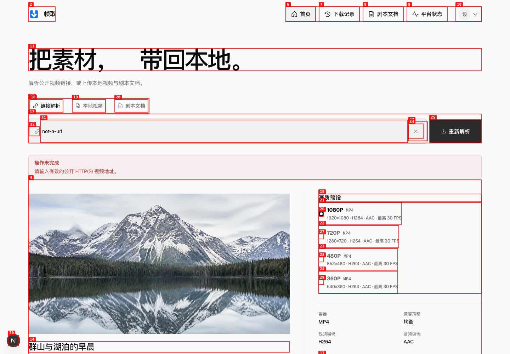
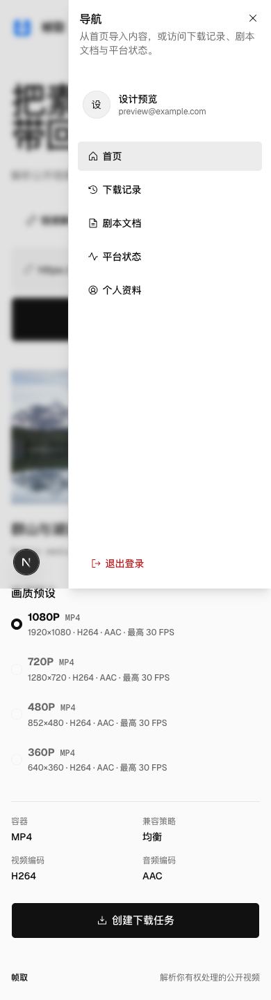
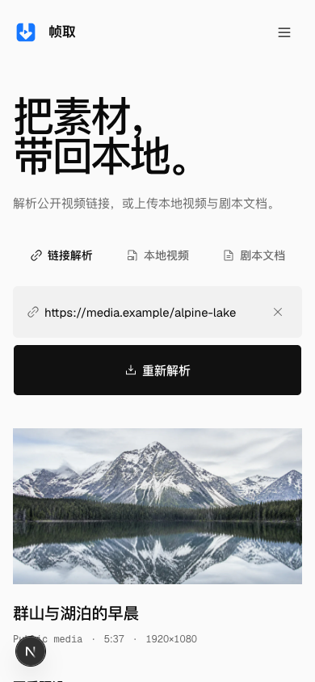
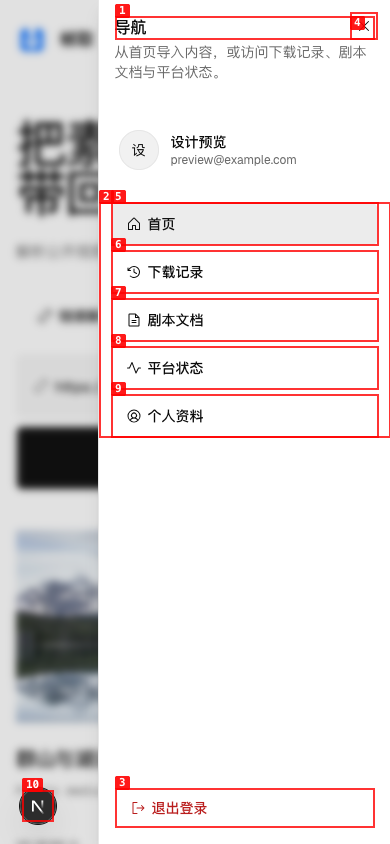
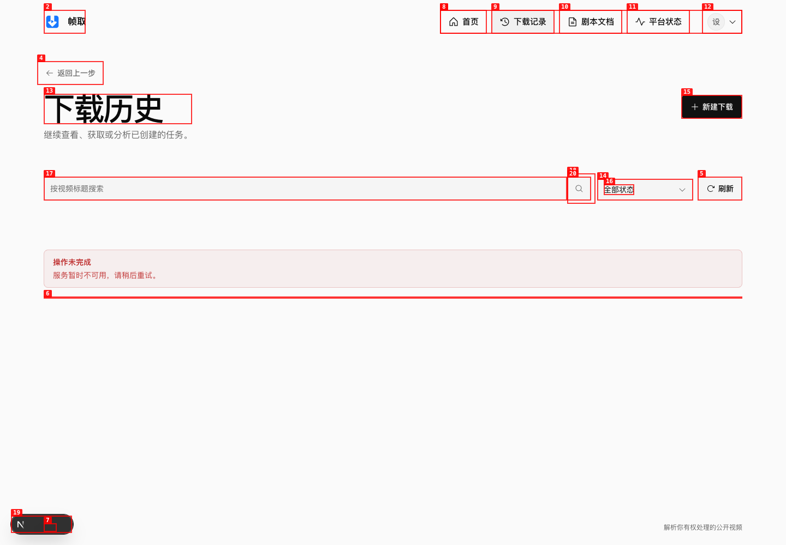
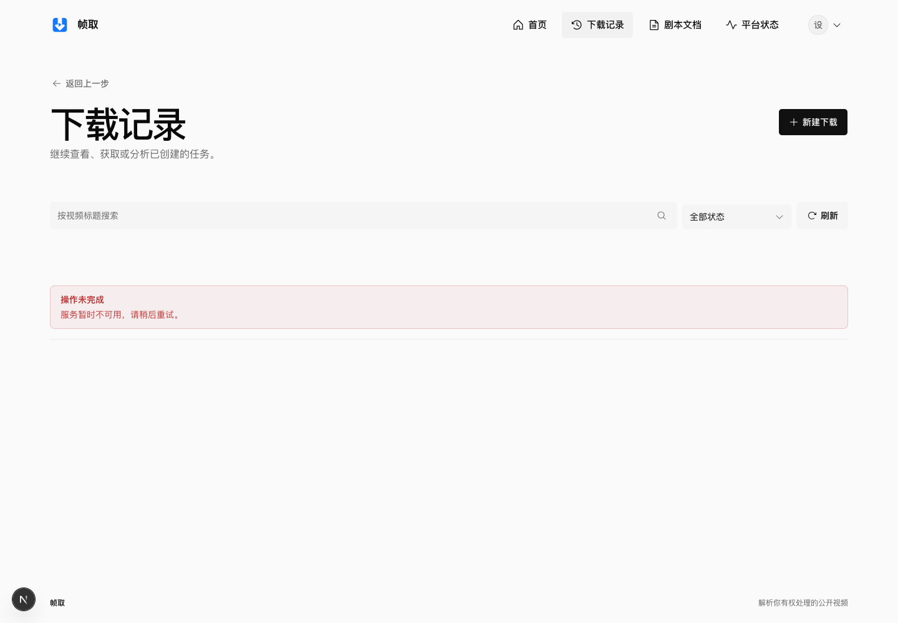
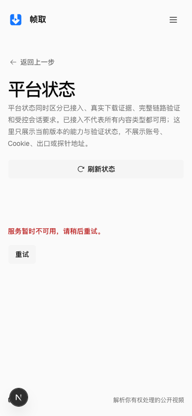

# Dogfood Report：Server 与 App 页面同步验收

| Field | Value |
|---|---|
| **Date** | 2026-08-27 |
| **App URL** | http://127.0.0.1:8101/?design=inspection |
| **Session** | video-server-app-sync-20260827 |
| **Scope** | Server 普通用户 Web 基线：首页、下载记录、剧本文档、平台状态、账户、响应式与 App 映射 |

## Summary

| Open Severity | Count |
|---|---:|
| Critical | 0 |
| High | 0 |
| Medium | 0 |
| Low | 0 |
| **Total Open** | **0** |
| **Resolved** | **4** |

## Coverage

| Area | Result | Notes |
|---|---|---|
| 桌面页面（1440×1000） | pass | 首页三种入口、下载记录、剧本文档、平台状态、账户均完成视觉与交互检查 |
| 移动页面（390×844） | pass | 五个一级页面、导航 Sheet、上传弹窗均无横向溢出；导航焦点回归通过 |
| 首页交互 | pass | Link / Local Video / Screenplay 切换、键盘方向键和 URL 结果失效逻辑正常 |
| 下载记录 | pass | 标题、导航、搜索与分页语义统一；搜索、筛选、刷新、返回和新建入口可操作 |
| 剧本文档 | pass | 上传弹窗可打开，Esc 关闭后焦点回到触发按钮；桌面和移动弹窗均在视口内 |
| 平台状态 | pass | 错误态和受控 API 成功态均已覆盖；加载按钮对比度回归后 axe 为 0 violation |
| 账户 | pass | 桌面/移动布局、字段语义和浏览器最小长度校验已覆盖 |
| 鉴权边界 | pass | 新会话访问 `/history` 正确跳转至 `/user/login?redirect=%2Fhistory`；空表单错误可读 |
| 键盘与偏好设置 | pass | Skip link、Tab、Tablist 方向键、弹窗焦点回退、深色模式、减少动态效果均已检查 |
| 自动无障碍扫描 | pass | 修复后首页、下载记录、剧本文档稳定态、平台状态、账户和登录页均为 0 violation |
| 开发环境 Web Vitals | informational | 390×844：TTFB 29.3ms、FCP 116ms、LCP 192ms、CLS 0.05；开发服务器数据不作为生产性能承诺 |

预检时因同步后的 `node_modules` 未安装 Vidstack 出现构建错误；执行 `npm ci` 后同一页面正常渲染，该项归类为环境恢复，不计产品缺陷。测试期间 API 代理目标 `127.0.0.1:8111` 未运行，因此下载记录、文档和平台的真实后端闭环未纳入本轮浏览器验收；平台成功态使用 agent-browser 的受控网络响应覆盖。页面自身未发现额外 JavaScript 异常。

## Acceptance Decision

**表现层通过。** ISSUE-001 至 ISSUE-004 已于 2026-08-27 完成修复并通过定向测试、完整前端门禁与 `agent-browser` 回归；当前开放问题为 0。真实 API 与原生客户端 E2E 仍按下方残余风险保持 Blocked，不计入本次表现层通过结论。

## Residual Risks

- `agent-browser` 验收对象是对应的 Server Web 基线；Flutter 原生 App 不启用 Flutter Web，其原生表现沿用同版本已通过的 `./tool/check.sh`、Android Debug、iOS Simulator 和 iPhone 17e 390×844 检查结果。
- API 代理目标 `127.0.0.1:8111` 未运行，真实下载、文档上传和平台探测闭环仍需在原生契约冻结后执行。
- `npm ci` 输出 2 个 high severity 依赖告警；本轮未执行安全定级或自动升级，需单独进行依赖安全审计。

## Issues

### ISSUE-001：无效 URL 校验后仍保留旧解析结果

| Field | Value |
|---|---|
| **Severity** | medium |
| **Status** | resolved |
| **Category** | functional / ux |
| **URL** | http://127.0.0.1:8101/?design=inspection |
| **Repro Video** | [videos/issue-001-stale-inspection.webm](videos/issue-001-stale-inspection.webm) |

**Description**

页面已有媒体解析结果时，将输入改为无效 URL 并重新解析，会正确显示“请输入有效的公开 HTTP(S) 视频地址”，但旧媒体封面、格式和“创建下载任务”仍然保留。错误输入与旧结果同时出现，用户无法确认当前结果对应哪一个 URL。预期在开始一次新的解析尝试或校验失败时清除/明确标记旧结果，且不能继续基于歧义状态创建任务。

**Fix Verification**

修改 URL 后解析结果和创建任务操作立即清除；继续提交无效 URL 时只显示校验错误。自动化回归与真实浏览器复验均通过。

**Repro Steps**

1. 打开带演示解析结果的首页。
   
2. 将“公开视频地址”改为 `not-a-url`。
   
3. 点击“重新解析”。
4. **观察：**错误提示出现，但“群山与湖泊的早晨”、画质预设和创建任务按钮仍显示。
   

---

### ISSUE-003：移动导航打开后焦点落在“退出登录”

| Field | Value |
|---|---|
| **Severity** | medium |
| **Status** | resolved |
| **Category** | accessibility / ux |
| **URL** | http://127.0.0.1:8101/?design=inspection（390×844） |
| **Repro Video** | [videos/issue-003-mobile-nav-focus.webm](videos/issue-003-mobile-nav-focus.webm) |

**Description**

打开移动导航 Sheet 后，`document.activeElement` 稳定为破坏性“退出登录”按钮，而不是导航标题、关闭按钮或第一个导航链接。键盘和屏幕阅读器用户进入导航时会首先落到退出动作，增加误操作风险。预期初始焦点落在导航标题/关闭按钮，或至少落在第一个“首页”导航链接。

**Fix Verification**

390×844 复验中活动元素为 `H2 / 导航 / tabindex=-1`，Radix 焦点圈定、关闭按钮与导航链接仍可正常使用。

**Repro Steps**

1. 在 390×844 视口打开首页。
   
2. 点击“打开导航菜单”。
3. **观察：**导航打开后，agent-browser 读取到活动元素为 `BUTTON / 退出登录`。
   

---

### ISSUE-002：下载页面一级术语不一致

| Field | Value |
|---|---|
| **Severity** | low |
| **Status** | resolved |
| **Category** | content / ux |
| **URL** | http://127.0.0.1:8101/history?design=inspection |
| **Repro Video** | N/A |

**Description**

同一页面的主导航名称为“下载记录”，页面 H1 为“下载历史”。两者指向同一能力，却使用不同一级术语，导致 Web 与 App 无法共享唯一的页面名称。预期导航、页面标题、App 文案和验收文档统一使用同一个词。

**Evidence**

**Fix Verification**

浏览器标题、H1、主导航、搜索控件和分页语义已统一为“下载记录”。

---

### ISSUE-004：平台状态加载按钮文字对比度不足

| Field | Value |
|---|---|
| **Severity** | medium |
| **Status** | resolved |
| **Category** | accessibility / visual |
| **URL** | http://127.0.0.1:8101/providers?design=inspection |
| **Repro Video** | N/A |

**Description**

平台状态首次加载时，“刷新状态”按钮处于禁用态，通用透明度把文字合成色降低为 `#7b7b7b`，背景约为 `#f7f7f7`。axe 4.12.1 测得对比度约为 3.95:1，低于普通 14px 文字所需的 4.5:1；规则 `color-contrast` 标记为 serious。

**Evidence**

**Fix Verification**

加载按钮保留禁用语义和完整文字对比度，并明确显示“刷新中…”；修复后平台状态页 axe 扫描为 0 violation。

---
